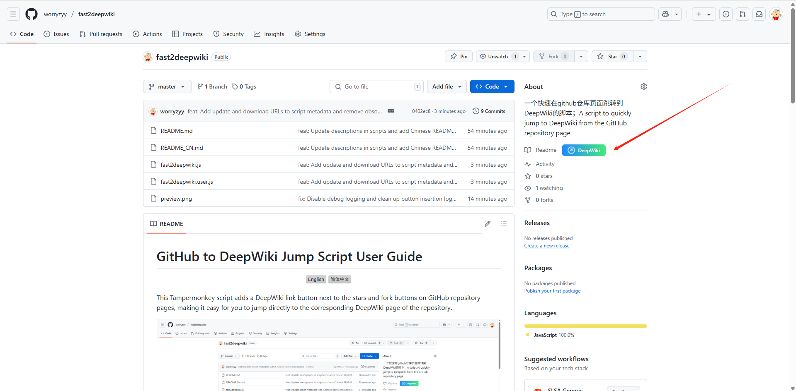

# GitHub 到 DeepWiki 跳转脚本使用教程

这个油猴脚本（Tampermonkey Script）可以在 GitHub 仓库页面的 Readme 链接旁边添加一个 DeepWiki 链接按钮，方便您直接跳转到对应仓库的 DeepWiki 页面。

## 安装步骤

### 前提条件

首先，您需要安装一个用户脚本管理器。我们推荐使用 Tampermonkey：

- [Chrome 版 Tampermonkey](https://chrome.google.com/webstore/detail/tampermonkey/dhdgffkkebhmkfjojejmpbldmpobfkfo)
- [Firefox 版 Tampermonkey](https://addons.mozilla.org/en-US/firefox/addon/tampermonkey/)
- [Edge 版 Tampermonkey](https://microsoftedge.microsoft.com/addons/detail/tampermonkey/iikmkjmpaadaobahmlepeloendndfphd)
- [Safari 版 Tampermonkey](https://apps.apple.com/app/tampermonkey/id1482490089)

### 方法一：一键安装（推荐）

1. 确保您已经安装了 Tampermonkey 或其他用户脚本管理器
2. 点击下面的安装链接：

   [安装 GitHub 到 DeepWiki 跳转脚本](https://github.com/worryzyy/fast2deepwiki/raw/refs/heads/main/fast2deepwiki.user.js)

3. Tampermonkey 会自动识别并提示您安装脚本
4. 点击"安装"按钮完成安装

### 方法二：手动安装

1. 点击[此链接](https://github.com/worryzyy/fast2deepwiki/blob/main/fast2deepwiki.user.js)查看脚本源码
2. 点击"Raw"按钮查看原始文件
3. 复制全部代码
4. 打开 Tampermonkey 菜单（点击浏览器工具栏中的 Tampermonkey 图标）
5. 选择"创建新脚本"
6. 删除编辑器中的默认代码，粘贴刚才复制的代码
7. 按 Ctrl+S（Mac 上使用 Command+S）保存脚本

## 使用方法

安装完成后，只需访问任何 GitHub 仓库页面，脚本会自动在 stars 和 fork 按钮旁边添加一个"DeepWiki"按钮。

1. 打开任意 GitHub 仓库页面
2. 在页面顶部的操作栏中（包含 Watch、Star、Fork 的区域），您会看到一个新的"DeepWiki"按钮
3. 点击该按钮即可在新标签页中打开相应仓库的 DeepWiki 页面

## 功能特点

- 自动匹配当前 GitHub 仓库，生成对应的 DeepWiki 链接
- 优雅的按钮设计，与 GitHub 原生界面融合
- 轻微的动画效果和交互反馈
- 自动适应 GitHub 页面结构的变化
- 支持各种仓库页面（主页、代码页、Issues 等）

## 故障排除

如果您在使用过程中遇到问题：

1. **按钮没有出现**

   - 刷新页面试试
   - 确认您是否在 GitHub 仓库页面（而非个人主页或其他页面）
   - 检查 Tampermonkey 是否启用了该脚本

2. **点击按钮后无法跳转**

   - 确认目标 DeepWiki 站点是否可访问
   - 检查您的网络连接

3. **脚本停止工作**

   - GitHub 可能更新了页面结构，请检查是否有脚本更新版本
   - 尝试重新安装最新版本的脚本

## 更新脚本

当有新版本发布时：

1. 重新访问安装链接
2. Tampermonkey 会提示您更新脚本
3. 点击"更新"按钮完成更新

## 反馈与贡献

如果您有任何建议或发现任何问题，欢迎通过以下方式反馈：

- [提交 Issue](https://github.com/worryzyy/fast2deepwiki/issues)
- [提交 Pull Request](https://github.com/worryzyy/fast2deepwiki/pulls)

## 隐私声明

该脚本不会收集或传输任何个人数据。它只在您的浏览器中本地运行，用于在 GitHub 页面添加 DeepWiki 链接。

## 许可证

MIT License

---

感谢使用 GitHub 到 DeepWiki 跳转脚本！希望它能提升您的开发体验。
